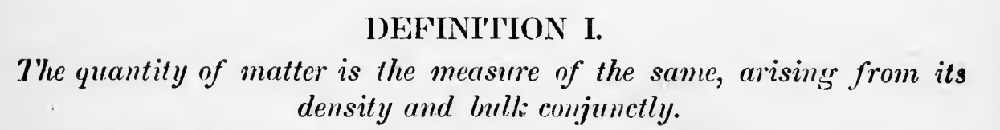

::: text-center
Functions
:::

{.img-fluid}

::: row
::: {.col-6 .p-2}
This definition, or statement of fact, is also known as a function. You are intimately familiar with functions, even if you don't know it yet. By the end of this chapter, I hope to influence the way you think about solving problems in the light of functional programming.

Newton's definition can be defined in R.
:::

::: {.col-6 .p-2}
```{r}
calculate_mass <- function(density, volume) {
    density * volume
}

calculate_mass(2, 2)
```
:::
:::
